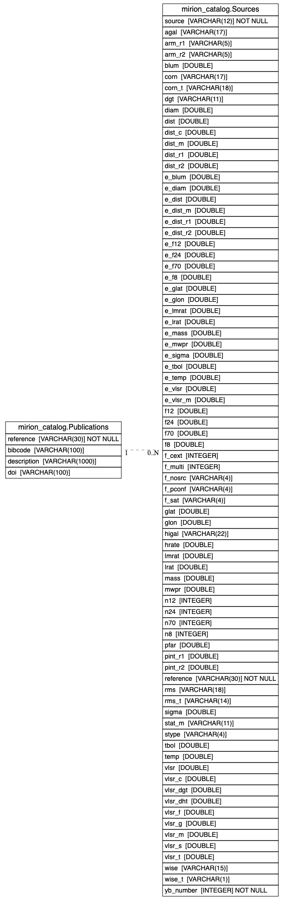

# Schema Documentation
This documentation is generated from the [schema.yaml](schema.yaml) file using [build_schema_docs.py](scripts/build_schema_docs.py).

## Tables
- [Publications](schema/Publications.md)
- [Sources](schema/Sources.md)

## Schema Diagram
This diagram is generated from the [schema.yaml](schema.yaml) file using [make_schema_erd.py](scripts/make_schema_erd.py).

